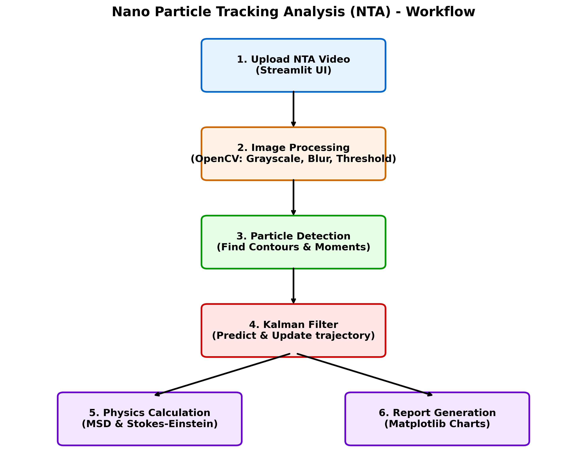

# Nano Particle Tracking Analysis (NTA) Web App Pro 🔬

Phần mềm mô phỏng thuật toán **Kalman Filter** sửa lỗi nhận diện AI trong môi trường vi lưu chất.

## 🚀 Sơ đồ hoạt động (Architecture Workflow)

Dưới đây là sơ đồ kiến trúc và luồng xử lý của ứng dụng:



## 🛠 Hướng dẫn cài đặt & sử dụng

1. Cài đặt các thư viện cần thiết:
   ```bash
   pip install -r requirements.txt
   ```
2. Chạy ứng dụng Streamlit:
   ```bash
   streamlit run app.py
   ```
3. Truy cập ứng dụng qua trình duyệt, tải lên video NTA và cấu hình các thông số để phân tích.

## ✨ Tính năng chính

- Nhận diện và theo dõi hạt Nano qua OpenCV.
- Thuật toán Kalman Filter để dự đoán và sửa lỗi đường đi của hạt.
- Tính toán kích thước hạt dựa trên phương trình Stokes-Einstein và Mean Squared Displacement (MSD).
- Biểu đồ báo cáo vật lý thời gian thực.
